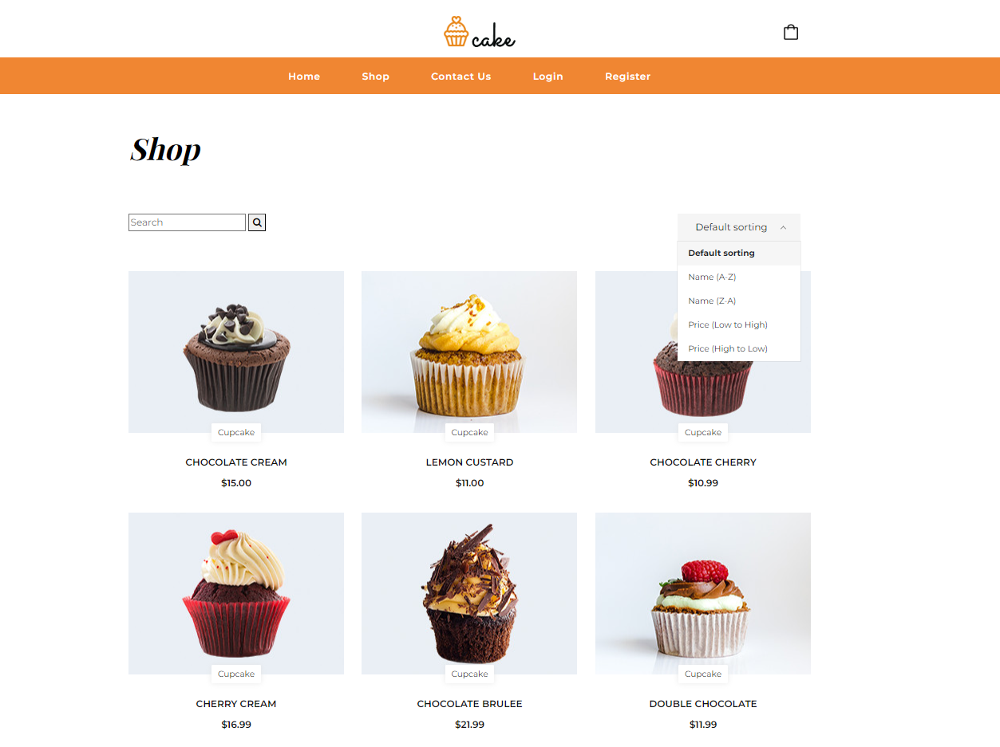

# Foodico

Foodico is an e-commerce web application of a bakery where customers can order products online and find information about the company.

## Tech Stack

Foodico is built using the following technologies and frameworks:

- **Frontend**:
  -ASP.NET MVC
  -(Premade template)
  

- **Backend**:
  - .NET 7
  - C#
  - ASP.Net Web API
  - Entity Framework Core for ORM (Code First approach)
  - MSSQL for the database
  - AutoMapper for object-to-object mapping
  - Stripe for payment processing
  - Microsoft Identity for authentication
  - JWT token for secure communication

- ### Messaging and Queueing
  - RabbitMQ for asynchronous communication between microservices. In particular, RabbitMQ is utilized for the email API to handle email sending asynchronously.

- **Microservices Architecture**:
  - Foodico is designed as a set of loosely coupled microservices, each responsible for a specific domain or functionality. This architecture allows to develop, deploy, and scale individual components independently, resulting in better agility and resilience.

- **Other Tools and Technologies**:
  - Caching for performance optimization
  - Toastr for showing notifications

## Features

### Customer Features

Foodico offers the following key features for customers:

- **Login:** Sign in to your account to access exclusive features, track orders, and manage preferences.
- **Register:** Create an account to get started with Foodico, enabling you to place orders, track order history, and more.
- **Logout:** Securely sign out of your account to protect your privacy and security.
- **Add to Cart:** Easily add products to your shopping cart for convenient ordering.
- **Filter Search:** Narrow down your product search results by applying filters based on categories, prices, or other criteria.
- **Sort Search:** Arrange search results according to different parameters such as price or alphabetical order.
- **Delete Item from Cart:** Remove unwanted items from your shopping cart with a simple click.
- **Apply Coupon Code:** Enter a coupon code during checkout to get discounts or special offers.
- **Delete Coupon Code:** Remove a coupon code from your order if it's no longer valid or required.
- **Online Payment with Stripe:** Make secure payments online using Stripe integration, supporting various payment methods.
- **Order Confirmation Email:** Receive an email confirmation for each order placed.

### Admin Features

As an admin, you have additional features to manage the Foodico platform:

- **Add Coupon:** Create new coupon codes to offer discounts to customers during checkout.
- **Update Coupons:** Modify existing coupon codes.
- **See All Coupons:** View a list of all existing coupons.
- **Add Product:** Upload new products to the platform, including details such as name, description, price, and images.
- **Update Product:** Modify existing product information, such as price, availability, or description.
- **Delete Product:** Remove products from the platform that are no longer available or relevant.

 # Project Showcase

### Video Preview

### Screenshots

### Home Page

### Login Panel

### Register Panel

### Shop

### Product Page

### Shopping Cart

### Checkout 

### Contact

### Email Confirmation

### Toastr Notification

  
